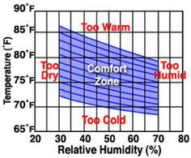
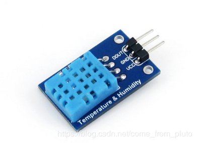
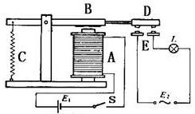
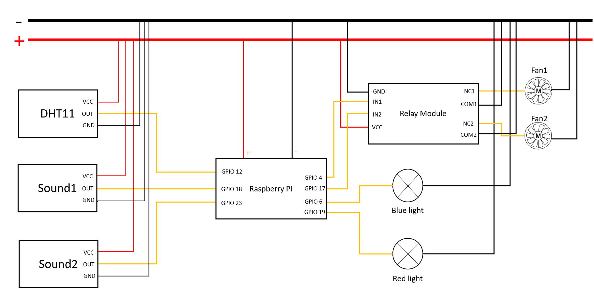
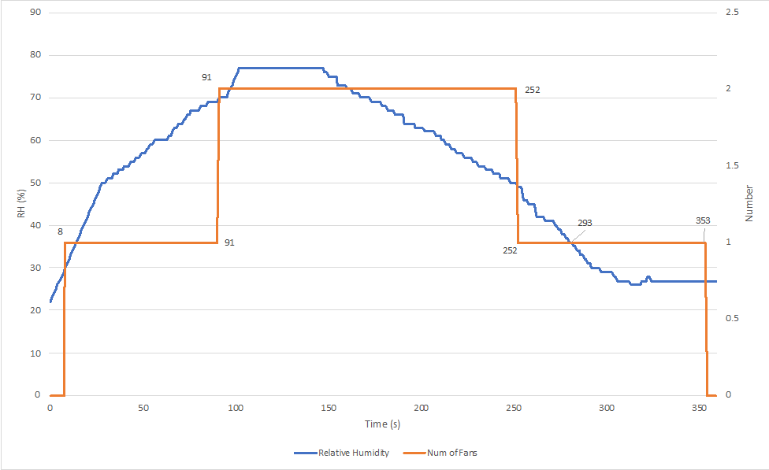
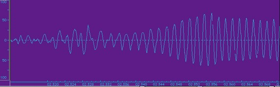

# Smart Bathroom

**Course**: 12740

**Group ID** : AL

**Group Member**: Xinmiao Liu; Mengmeng Pan; Yuanpeng Cao; Peng Zeng

  

### [Progress report 1 （9.28）](https://github.com/yuanpenc/Yuanpeng.github.io/blob/master/progress%20report/progress%20report%201(9.28).md)
### [Progress report 2 （10.3）](https://github.com/yuanpenc/AL-term-project.github.io/blob/master/progress%20report/progress%20report%202(10.3).md)
### [Progress report 3 （10.6）](https://github.com/yuanpenc/AL-term-project.github.io/blob/master/progress%20report/progress%20report%203(10.6).md)
### [Progress report 4 （10.10）](https://github.com/yuanpenc/AL-term-project.github.io/blob/master/progress%20report/progress%20report4(10.10).md)
### [Progress report 5 （10.13）](https://github.com/yuanpenc/AL-term-project.github.io/blob/master/progress%20report/progress%20report5(10.13).md)

### [Video](https://vimeo.com/user102264112/review/367174998/90f4738185)
### [OpenChirp](https://openchirp.io/home/device/5da3e30b466cc60c381e0cdd#properties)

## Introduction

  

  (https://giphy.com/gifs/disney-cuddling-CqGm2DE1eX5iE)

With the rapid development of science and technology, our life is becoming more and more convenient, the intelligent level of household is also improving. The bathroom, a place we use every day, naturally attracts us to make more efforts to make it smarter. 

Our project aims to create a better bathing environment through ‘smart fans’ and ‘smart lights’. The ‘smart fan’ can switch on and off automatically. So, we don't have to worry about forgetting to turn off the fan after a shower. Many people like to play music in the shower, our ‘smart light’ will flash to the rhythm of music, which makes your shower time more fun.

## Motivation
When taking a bath, the humidity inside the bathroom will rise. Therefore, no matter when bathing or after bathing should be timely ventilation, that is, should let air flow. This is especially important to the elderly and children to assure their breath open when taking bath. Meanwhile, the moist environment is a breeding ground for bacteria. Accordingly, it is very necessary that let the bathroom return dry and clean as soon as possible. But it takes a while for the bathroom to get dry again, and sometimes people may forget to turn off the fan, so it would be nice if the fan could automatically turn off when the bathroom returns dry. Taking shower is usually boring, and bathrooms are often decorated in a simple style. Our ‘smart lights’ will make the bathroom more colorful, and the flashing lights along with the rhythm makes shower time fun.

## Specific Goals
The overall goal of our project is to use temperature and humidity sensor to detect the humidity in the bathroom and control the switch of the fans through the relay module. Also, sound detection sensor to detect the music sound that plays while you are in the shower.
The specific goals to be achieved in the process of reaching the final goal are as follows:

* Using a sound detection sensor to detect the playing music. 
* Using DHT11 to detect the humidity and temperature in the environment.
* Using codes to let DHT11 control the switch of fans.
*	Connect all the sensors and actuators to the raspberry pi simultaneously.

## Review of the Phenomena of Interest

### Physical Principles
The relative humidity (RH) is the ratio of partial pressure of vapor in the air to the saturate vapor pressure in the air at the same temperature. If the relative humidity in the air is higher, the air is much more humid. When the relative humidity is approaching 100%, the air is saturated with vapor and it is called dewpoint[1].

  

  Figure 1. Comfortable humidity environment
  (https://www.brighthubengineering.com/hvac/81719-best-indoor-humidity-range-for-people-books-and-electronics/)

Sound could be detected because of vibration of sound source. The vibration of sound source can also pass on to the air then detected by the microphone. The sound signal of music have different frequencies between approximately 20 to 20,000Hz, which is the range of frequency human could hear. We always use electrical voltage to analog a series of sound signals and use binary numbers for outputting digital signals[2].

### Statistic and Dynamic Behavior
Relative humidity is measured one second a time and RH would change every second. Since our group simulate the vapor water generated during bathing by portable steamer, relative humidity can increase relative fast compared with reality. Therefore, RH would increase fast at first and then decrease slowly when the fans are working. 

Sound signal in our project is a binary signal, which only have value of 0 or 1. The music sound changed its sound intensity because of the beats and various musical instruments. The sound signal represent the relative high sound intensity in a music. Through set up the sleep time, sound signal catch up the beats with high sound intensity and return 1 to the interface. However, there are little delays to catch up the beats because of the slow response time. 

### Signal Characteristic
Humidity signal: According to the American Society of Heating, Refrigerating and Air-Conditioning Engineers (ASHRAE), the most comfortable humidity range is 30-60% relative humidity for human.[4] The relative humidity in the room(where we test our model) is about 50%, and the highest relative humidity when bathing is about 95%. So the RH signal range is around 50-95% and the value is measured one time a second. [1] 

Sound signal: “Sound signal is detected by sound intensity, which is defined as the power carried by sound waves per unit area in a direction perpendicular to that area.” [5] Whether the sound signal could be detected is based on the distance of sensor and sound source and music sound signal. Sound signal in our project is a binary signal, which only have value of 0 or 1. In addition, we set the sleep time of sound sensor based on the light effect, which are 0.05s and 0.2s respectively. So the sound signal is detected every 0.05s and 0.2s. 

### Sensor(s) Used

#### DHT11

  

  Figure 2. The Temperature and Humidity Sensor(http://www.programmersought.com/article/4519520653/)

  

  Figure 3. Our DHT11

#####	Physical Principles
It is a type of resistive humidity sensors that measure the resistance conductivity. The principle is the fact that the conductivity in non-metallic conductors is dependent on their water content. The resistive humidity sensor is made up of materials with relatively low resistivity and resistivity changes significantly with changes in humidity. The relationship between resistance and humidity is inverse exponential. The measurement range is 20-90%RH, temperature measurement range is 0-50℃.

##### Static and Dynamic Behavior 
This sensor includes a resistive-type humidity measurement component and an NTC temperature measurement component, and connects to a high- performance 8-bit microcontroller, offering excellent quality, fast response, anti-interference ability and cost-effectiveness. Applying the DHT11 sensor beyond its working range stated in this datasheet can result in 3%RH signal shift/discrepancy. The DHT11 sensor can recover to the calibrated status gradually when it gets back to the normal operating condition and works within its range. 

##### Sensor Characteristics
The ranges and accuracy of the DHT11: 
* Humidity Range: 20-90% RH
* Humidity Accuracy: ±5% RH
* Temperature Range: 0-50 °C
* Temperature Accuracy: ±2% °C
* Operating Voltage: 3V to 5.5V

  Table 1. Properties of DHT11[9]

  

#### 1PCS 3pin Voice Sound Detection Sensor Module

  

  Figure 4. The Sound Detection Sensor[7]

  

  Figure 5. Our Sound Detection Sensor

##### Physical Principles
It can detect the intensity of the sound environment. The sound sensor can identify the presence of (according to the principle of vibration). The sensor provides a digital output when the measured sound increases beyond a set threshold. This threshold level can be adjusted using an onboard potentiometer. The sensor outputs a logic one(+5V) at the digital output when it detects sound and a logic zero(0V), when there is no sound detected

##### Static and Dynamic Behavior 
This is a multipurpose sound sensor which can be used to sense sound and audio. An onboard LED is used to indicate the output status. The onboard potentiometer can be used to set the sound threshold. To set the potentiometer, use a screw driver.

##### Sensor Characteristics

  

  Figure 6. The Sound Detection Sensor[8]

* It can detect the intensity of the sound environment. The sensor can only identify the presence of sound, cannot recognize the sound or the size of the particular frequency of sound
* The sensitivity adjustable digital potentiometer to adjust 
* Working voltage of 3.3 V to 5 V
* Output form digital switch output 

When less sensitive, it takes more sound to trigger the device and when more sensitive, it takes less sound to trigger the device. Three instructions Sound module sound intensity is the most sensitive to the environment, commonly used to detect the intensity of the sound of the surroundings. Module in the intensity of the sound environment than set threshold, the OUT output high level, when the intensity of the sound from the outside environment more than set threshold, the module OUT output low level. This sensor can be directly driven relay module, which can form a voice-activated switch.

#### 5V-2 Channel Relay Module

  

  Figure 7. Our 5V-2 Channel Relay Module

##### Features
* Relay Maximum output: DC 30V/10A, AC 250V/10A
* 2 Channel Relay Module with Optocoupler LOW Level Triger expansion board, which is compatible with arduino
* Standard interface that can be controlled directly by microcontroller ( 8051, AVR, *PIC, DSP, ARM, ARM, MSP430, TTL logic)
* Relay of high quality loose music relays SPDT. A common terminal, a normally open, one normally closed terminal
* Optocoupler isolation, good anti-jamming
##### Principle
See the picture below: A is an electromagnet, B armature, C spring, D moving contact, and E fixed contacts. There are two fixed contacts, a normally closed one and a normally open one. When the coil is not energized, the normally open contact is the one that is off, while the normally closed one is the other that is on.

  

  Figure 8. 5V-2 Channel Relay Module(http://wiki.sunfounder.cc/index.php?title=File:2cha3.jpg)

Add a certain voltage to the coil and some currents will pass through the coil thus generating the electromagnetic effect. The armature overcomes the tension of the spring and is attracted to the core, thus closing the moving contact of the armature and the normally open contact (or you may say releasing the former and the normally closed contact). After the coil is de-energized, the electromagnetic force disappears and the armature moves back to the original position, releasing the moving contact and normally closed contact. The closing and releasing of the contacts results in power on and off of the circuit.
##### Input
VCC : Connected to positive supply voltage (supply power according to relay voltage)
GND : Connected to negative supply voltage
IN1: Signal triggering terminal 1 of relay module
IN2: Signal triggering terminal 2 of relay module
##### Output
Each submodular of the relay has one NC(nomalclose), one NO(nomalopen) and one COM(Common). So, there are 2 NC, 2 NO and 2 COM of the channel relay in total. NC stands for the normal close port contact and the state without power; No stands for the normal open port contact and the state with power. COM means the common port. You can choose NC port or NO port according to whether power or not.
## Experiments

  

  Figure 9. The Whole Circuit

  

  Figure 10. The Whole Circuit

  

  Figure 11. Our model

  

  Figure 12. Our model

Several tests were conducted to ensure the project was working as expected:
Focus on the ‘smart fans’ firstly. According to the comfortable range to human body is 30-60%, we set two certain levels---55% and 65%, that is, when the absolute humidity in bathroom rises to 55%, one ventilating fan begin to work; when the humidity rises to 65%, both two fans work. Use portable garment steamer to simulate the steam generated by bathing. As the steam spread to the whole bathroom (box), one of the fans began to work. As the steam continued to increase, the two fans began to work at the same time. Stop using the garment steamer, along with the fans, the humidity in the bathroom continued to drop, and when it reached 65%, one of the fans stopped working and the other continued to work until the humidity drops to a certain value.

Then, for the smart light part. Run the code and play the music, we can see that the light flicker with the music rhythm. We set different sleep time for the two lights in the code. Blue light has shorter sleep time to the sound signal than the red one. Therefore, two lights flicker with different frequency. Now, we can enjoy a fancy shower time! 

More details show in the video!

### Efficiency and Power Consumption of Different Fans' Modes
#### Experiment Purpose
1. Verify the feasibility of the model
2. Find the best solution

#### Experiment Principle
At the beginning, we set three different modules as the following sheet.

  Table 2. Mode of controlling fans

  

Then, we don’t know the fan efficiency, so we cannot calculate the fan work. However, we know the rated voltage and the rated current of two fans, therefore, we can calculate the rated power theoretically. Due to the above reason, if we can know how long the fan works, we can calculate the power consumption of them. We decide to use control variates method in order to eliminate the external interference. However, because it is hard to control the humidity in the experiment box when we use the portable garment steamer to humidify the box, we set the same time to humidify to promise the vapor the box gets is the same. After the fan turning off, we can get the time how long the humidity becomes from high humidity to low humidity and use the following function to calculate the power consumption.

  

Where, P is the power consumption, U is the rated voltage, I is the rated current and T is the measuring time.

#### Experiment Steps
1. Start the Raspberry Pi and use the terminal to connect it.
2. Use the tmux to set four screens.
3. Open ‘Fan1-test.py’, ‘Fan2-test.py’, ‘Sound1.py’ and ‘Sound2.py’ into four screens separately.
4. Measure the indoor temperature and humidity.
5. Wait for the measurements in four screens to become steady close to the indoor temperature and humidity.
6. Use the portable garment steamer to humidify the experiment box for ten seconds and the fans will turn on.
7. After ten seconds, turn off the portable garment steamer.
8. When the fans turn off, read and clean the data.
9. Repeat the steps 5 to 8 five times to get five sets of data
10. Calculate the time how long the humidity becomes from high humidity to low humidity.
11. Calculate the mode, standard deviation and confidence intervals of the fan power consumption.
12. Change the codes into three conditions and repeat the steps 5 to 11.
13. Compare three sets of data and find the best condition to remove the vapor.

#### Experiment Expectation
In order to keep the indoor humidity to reach the pre-setting value and promise the effect of removing vapor with the lowest energy consumption, our group set up two fans with delay. When the humidity is lower than 70%, the first fan will turn off in 30s to promise that the humidity will not return higher than 70%. The same thing happens below 50%. The method can be explained as the following figure:

  

  Figure 13. Experiment Expectation

We expect the relationship between the fan and the indoor relative humidity to be shown in the figure. Assuming that at 8 seconds, the humidity in the box reaches 30% and starts to gradually increase. At this time, the first fan will turn on. At 91 seconds, the humidity exceeds 70%, the second fan opens and both two fans are running. When the humidity is lower than 50%, which is 252 seconds, the second fan turns off and only one fan is running. When the humidity lowers down to 35% gradually, which is 293 seconds, because we set a delay of 60s, the last one fan will turn off at 353 seconds.

#### Experiment Conclusion
Because of the real indoor environment, we change the criteria of the setting humidity. But it didn’t affect the results. We set the high humidity to 65%, and low humidity to 55%.

1. Meet our Expectation:

  

  Figure 14. One of the Data Result

As we expected, one of our testing data is similar to the experiment expectation figure xx. At 133 seconds, the humidity was lower than 65%, the second fan was not turning off until 30 seconds later, which is 161 seconds. At 291 seconds, the humidity reached at 55%, the first fan did not stop until 30s later proximately. All of these reach our experiment expectation.

2. Mode 1 is the best:

  Table 3. Raw Data of three Modes

  

  Table 4. Power consumptions of three Modes

  

  

  Figure 15. Electrical Work in Different Modes

  Table 5. Data Analysis of three Modes

  

After collecting and cleaning all the sets of data, we make the figure and tables above. The figure 15 is about the electrical work in different modules. The table 3 is the raw data, which is about how long the time of humidity decreasing from 95% to 55%. In the mode1, the first column is 30s/140s, which means how long two fans worked together and how long the last one fan worked when the second fan closed. In other words, it took 30s for two fans working and took 140s for last one fan working. The table 4 is shown the total power consumption of each mode in each time. The orange blank means the bad value, which we need to exclude. We use excel to help us make the data analysis. From the table 5, we can know that the mean of mode 1 is the smallest, which means that over the 23 experiment times, the mode 1 cost the lowest electric consumption. The standard deviation of the mode 1 is also the smallest, which means the fluctuation of data is the smallest. Both double fans and single fans are not stable. Although the range is not the smallest, we think it can be accepted compared with others. To sum up, the mode 1 is the best way to lower the humidity in model bathroom compared with the mode 2 and mode 3.

### Comparison to Original Goals
We basically achieved our original goal of creating a fan that can automatically switch on and off according to humidity, and a light that can flash according to music rhythm. Due to limited conditions, we can only test in the model. If we apply our idea to practice, we need to replace a bigger fan. At the same time, if there are more LED lights, the ‘smart light’ will look fancier.

### Errors

The error in the project comes from three sources. 

* Sensor:Our project uses sound detect sensor, and temperature and humidity sensor. For the temperature and humidity sensor, the error mainly comes from the nonlinearity of transfer function and the poor accuracy. 
* Noise:For the sound detection sensor, it is affected by the noise from both the circuit and the surrounding environment. When the sound sensor is very sensitive, the tiny sound will trigger the flicker of the light. For the temperature and humidity sensor, the situation is better.
* Control:As the test box is very small, when we use the steamer to simulate the shower mist, the air humidity in the box will increase to a high level instantly, making the two fans start to work almost at the same time. 

## OpenChirp
"OpenChirp is a management framework, which can provide us with services of data context, storage, visualization, and access control through the web."[6] We can directly utilize openchirp to control the switch of lights and fans. To relize this, we set up connettion between Raspberry Pi and OpenChirp, and then we run command on the openchrip webpage and send signal to our actuator devices. In that case, we can realize the goal of remoting control actuators.

Following are pictures of the results of our code and images drawn by OpenChirp websit.

  

  Figure 16. results of Raspberry-Openchirp codes 

After we click Fan on and light on buttons as we shown in the video, the results of codes turn out to be 1, which means the light and fan are already turn on. Otherwise, if we run the Fan off and light off commands, the results begin to be 0, which means light off and fan off. 

  

  Figure 17. Binary values of fan and light  

The images generated by OpenChirp are corresponding to the values detected by Raspberry Pi. We realized the goal of remoting control actuators by assistance of OpenChirp .

Also, we published the data detected by DHT11 sensor. The line chart is time series for the change of humidity and temperature.

  

  Figure 18. Time series for the change of humidity and temperature  

We also published our data of sound module sensor. The image below only shows two values, 1 and 0, because the sound module sensor is binary and can only generate binary output values. 

  

  Figure 19. Values generated by sound module sensor  

## Discussion
* Experimental conditions limit our model to a simple simulation of the idea. Due to the limitation of raspberry pi’s working voltage, we can only choose fans with working voltage of 5V. Low power leads to low exhaust efficiency. If put our ideas into practice, we should replace more power fan to improve work efficiency. If possible, we can use more colorful lights and control them with codes to make the smart lights more fancy.
* The sound module sensor we used is binary, so we can only get the binary values. In the future, we can change a more advanced sound sensor that can detected the amplitude and frequency of the sound. We can make more fun by controling the light on and off corresponding to not only the amplitude but also the frequnency.
* We could use Python or Matlab to draw a signal graph and do more signal graph analyzing. For example, we could input a music to Python and output a sound signal graph by using building a mathematical function in Python. The music signal graph is shown as in figure.

  

  Figure 20. A music signal graph(http://sites.music.columbia.edu/cmc/MusicAndComputers/chapter1/01_01.php)

## Reference
[1] https://en.wikipedia.org/wiki/Relative_humidity

[2] https://en.wikipedia.org/wiki/Audio_signal

[3] https://www.digikey.com/en/articles/techzone/2011/oct/humidity-sensors-and-signal-conditioning-choices

[4] https://www.brighthubengineering.com/hvac/81719-best-indoor-humidity-range-for-people-books-and-electronics/

[5] https://en.wikipedia.org/wiki/Sound_intensity

[6] https://openchirp.io/

[7] https://www.google.com/imgres?imgurl=https://ae01.alicdn.com/kf/HTB1qwCPaxD1gK0jSZFKq6AJrVXa8.jpg_q50.jpg&imgrefurl=https://www.aliexpress.com/i/1625383225.html&h=1000&w=1000&tbnid=3z5bB5-B54P9OM&tbnh=225&tbnw=225&usg=K_J-Ob3ECtF-U9uqeKhyZGPlWgVbs=&hl=en&docid=UM3v3gGctfkKdM&itg=1

[8] (https://www.google.com/imgres?imgurl=https%3A%2F%2Frobu.in%2Fwp-content%2Fuploads%2F2017%2F09%2FArduino-Sound-Detection-Sensor-Pin-Outs.png&imgrefurl=https%3A%2F%2Frobu.in%2Fproduct%2Flm393-sound-detection-sensor-module-black%2F&docid=dpZTNGya6KegnM&tbnid=PkIyhLsPK12dlM%3A&vet=10ahUKEwj6-ajbteXlAhVNT98KHXRvC8gQMwgrKAAwAA..i&w=681&h=248&hl=en&bih=568&biw=1280&q=sound%20sensor%20pin%20configuration&ved=0ahUKEwj6-ajbteXlAhVNT98KHXRvC8gQMwgrKAAwAA&iact=mrc&uact=8

[9] https://www.mouser.com/datasheet/2/758/DHT11-Technical-Data-Sheet-Translated-Version-1143054.pdf

